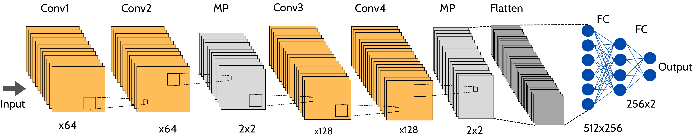
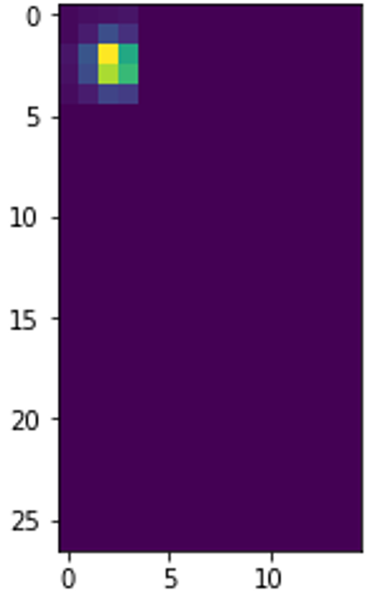

<div align="center">
<h2>FingerQuant</h2>
<h4>Research on a Quantization Method to Optimize Deep Learning Models for Finger Recognition</h4>
</div>

## Abstract
According to current statistics, smartphones have become widespread, and almost all of them integrate a touchscreen as the primary interface for direct interaction. Although the concept of direct touch seems natural to users, the vocabulary of touch input is limited compared to traditional hardware devices such as keyboards and mice. If different finger inputs on the display can be distinguished, then the same input performed with different fingers could trigger different functions—similar to using multiple buttons on a computer mouse or keyboard. The goal of this project is to optimize the size of a simple finger classification model so that it can be easily deployed on devices without consuming too many resources.

<p align="center">
    
    <br>
    Finger Classiffier.
</p>

## Usage
### 1. FP model.
The PD-Quant method is implemented on three different models and applied to two cases: left–right thumb classification and ten-finger classification.
The model takes as input capacitive touchscreen data, which has been preprocessed into grayscale matrices of size 8×8.
<p align="center">
    
    <br>
    CapFingerId.
</p>
<p align="center">
    
    <br>
    Model 1.
</p>
<p align="center">
    
    <br>
    Model 2.
</p>

<p align="center">
    
    <br>
    Input_data.
</p>

### 2. Installation.
```
python = 3.7.13
numpy = 1.21.6
torch = 1.11.0
torchvision = 0.12.0
```

### 3. Run experiments
You can run ```run_script.py``` with different settings by modifying the quantization bit-width in the file.

The weights and activations of convolution and linear layers are quantized sequentially, layer by layer, until the last layer of the model is processed.  
The optimization objective consists of two main components:  

1. **Normalization Loss** – the instantaneous output difference of the current layer being quantized, measured between the quantized model and the FP model using Mean Squared Error (MSE).  
2. **Prediction Difference Loss** – the difference in the final predictions between the quantized model and the FP model, measured using Kullback–Leibler (KL) Divergence.

#### Experimental Results
The highest accuracy achieved in the experiments of the models is presented in the following tables.
#### Task: Distinguishing Between Two Thumbs
| Model             | Original Accuracy | Quantized Accuracy | Accuracy Drop |
|-------------------|------------------:|-------------------:|--------------:|
| CapFingerId       | 92.13%            | 90.29%             | 1.84%         |
| Model 1           | 91.50%            | 91.38%             | 0.12%         |
| Model 2           | 93.36%            | 93.13%             | 0.23%         |

#### Task: Distinguishing Between Ten Fingers
| Model             | Original Accuracy | Quantized Accuracy | Accuracy Drop |
|-------------------|------------------:|-------------------:|--------------:|
| CapFingerId       | 62.03%            | 61.35%             | 0.68%         |
| Model 1           | 48.96%            | 48.92%             | 0.04%         |
| Model 2           | 59.02%            | 57.17%             | 1.85%         |

The detailed results of the three models when varying three key parameters are shown below:
* **Recon Iterations:** The number of reconstruction iterations used to minimize the total loss, which includes Prediction Difference Loss ($L_{PD}$), Regularization Loss ($L_{Reg}$), and Weight Rounding Loss.
* **$\lambda_r$ Weight:** A weighting factor inversely proportional to the influence of the Regularization Loss ($L_{Reg}$) in the total loss.
* **DC Iterations:** The number of input correction iterations that bring the input closer to the batch normalization distribution, thereby improving generalization for calibration data.


#### Table: Detailed Experimental Results for Model 1

| Recon Iterations | DC Iterations | $\lambda_r$ Weight | Accuracy (2 classes) | Accuracy (10 classes) |
|:----------------:|:-------------:|:------------------:|:--------------------:|:---------------------:|
| 20000            | 500           | 0.1                | 90.03%               | 56.83%                |
| 2000             | 500           | 0.1                | 89.90%               | 56.76%                |
| 2000             | 100           | 0.1                | 89.91%               | 56.72%                |
| 2000             | 100           | 0.2                | 90.05%               | 56.92%                |
| 20000            | 500           | 0.3                | 90.29%               | 57.09%                |
| 2000             | 100           | 0.3                | 90.14%               | 57.05%                |

| Recon Iterations | DC Iterations | $\lambda_r$ Weight | Accuracy (2 classes) | Accuracy (10 classes) |
|:----------------:|:-------------:|:------------------:|:--------------------:|:---------------------:|
| 20000            | 500           | 0.1                | 84.41%               | 10.05%                |
| 2000             | 500           | 0.1                | 91.20%               | 43.93%                |
| 2000             | 100           | 0.1                | 91.09%               | 43.94%                |
| 2000             | 100           | 0.2                | 91.38%               | 44.36%                |
| 2000             | 300           | 0.1                | 91.14%               | 43.92%                |

| Recon Iterations | DC Iterations | $\lambda_r$ Weight | Accuracy (2 classes) | Accuracy (10 classes) |
|:----------------:|:-------------:|:------------------:|:--------------------:|:---------------------:|
| 20000            | 500           | 0.1                | 91.11%               | 27.02%                |
| 2000             | 500           | 0.1                | 92.35%               | 27.22%                |
| 2000             | 100           | 0.1                | 92.33%               | 27.21%                |
| 2000             | 100           | 0.2                | 92.50%               | 27.17%                |
| 2000             | 300           | 0.1                | 92.37%               | 27.21%                |
| 100              | 500           | 0.1                | 93.13%               | 55.64%                |

### References
The research and implementation in this project are based on [**PD-Quant**](https://arxiv.org/pdf/2212.07048).

